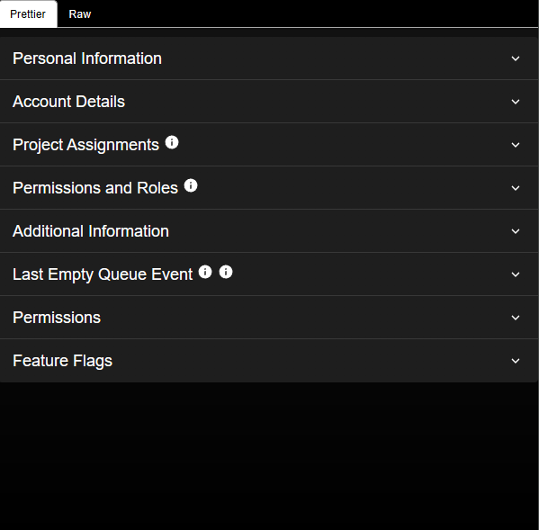
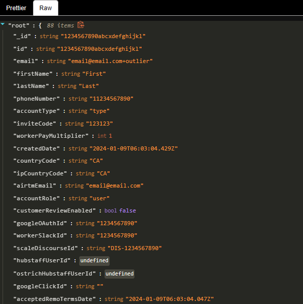

 

# Outliers Assistant

Your assistant for Outliers, providing additional details about your account. Before you send emails/tickets/dms, have a look at some of the values set for your account and see if it answers your questions. Your account data in your own hands (kinda). Not affliated with Outliers.

The extension needs a tab with Outliers open to access info, but you don't need to open one manually because the extension will open and close one quickly if needed. The permission "Read and change all your data on all websites" is required for looking through your tabs to find an existing Outliers tab and creating/closing one if none are found. 

## Getting Started

These instructions will get you a copy of the project up and running on your local machine for development and testing purposes.

[See here](https://github.com/Jonghakseo/chrome-extension-boilerplate-react-vite?tab=readme-ov-file#getting-started) for in-depth and extensive instructions

## Built With

* [Chrome Extension Boilerplate](https://github.com/Jonghakseo/chrome-extension-boilerplate-react-vite) - A boilerplate that helps with creating Chrome/Firefox extensions usiung React and Typescript

## Contributing

Please read [CONTRIBUTING.md](CONTRIBUTING.md) for details on our code of conduct, and the process for submitting pull requests to us.

## Versioning

We use [SemVer](http://semver.org/) for versioning. For the versions available, see the [tags on this repository](https://github.com/outliers-assistant/tags). 

## Authors

* **Jonghakseo** - *Boilerplate* - [Jonghakseo](https://github.com/Jonghakseo)
* **Jason Yue** - *Chrome Extension development* - [kymotsujason](https://github.com/kymotsujason)

See also the list of [contributors](https://github.com/outliers-assistant/contributors) who participated in this project.

## License

This project is licensed under the MIT License - see the [LICENSE.md](LICENSE.md) file for details

## Acknowledgments

* [Jonghakseo](https://github.com/Jonghakseo) chrome extension boilerplate with a working content script
* [gulshan_jakhon_](https://www.reddit.com/user/gulshan_jakhon_/) from reddit for finding the network key [here](https://www.reddit.com/r/outlier_ai/comments/1hwiryn/how_to_check_your_profile_status_in_outlier/)
